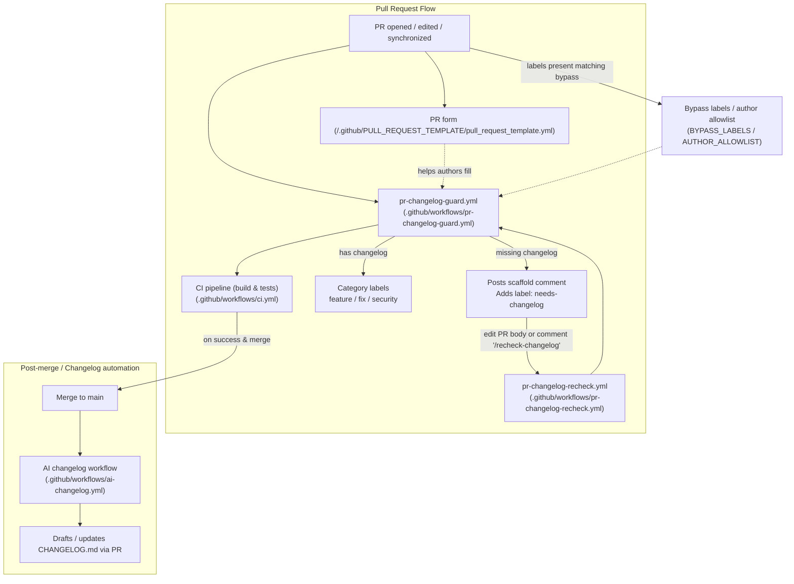

# Architecture: CI and PR changelog enforcement

This document describes the automated flow for Pull Requests, changelog enforcement, CI, and the AI-assisted changelog PR that updates `CHANGELOG.md`.

## Diagram

## Components referenced

- `.github/PULL_REQUEST_TEMPLATE/pull_request_template.yml` — structured PR form presented to contributors.
- `.github/PULL_REQUEST_TEMPLATE.md` — human-readable PR template that encourages a `## Changelog` section.
- `.github/workflows/pr-changelog-guard.yml` — checks PR bodies for a completed `## Changelog` section, posts a scaffold comment and adds `needs-changelog` when missing, or applies category labels when present.
- `.github/workflows/pr-changelog-recheck.yml` — listens for `/recheck-changelog` comments and re-runs the guard logic.
- `.github/workflows/ci.yml` — main CI pipeline (pnpm install, build, test).
- `.github/workflows/ai-changelog.yml` — (optional) workflow that runs after merge to draft or open a PR updating `CHANGELOG.md`.
- `CHANGELOG_GUIDE.md` — writing guidance and examples for contributors.

## Notes and operational details

- Bypass rules: The guard supports environment configurable bypass labels (`BYPASS_LABELS`, default: `chore,dependabot,no-changelog-needed`) and an `AUTHOR_ALLOWLIST`. When bypass conditions apply the guard won't fail and will remove an existing `needs-changelog` label.
- UX: When the guard detects a missing changelog it posts a helpful scaffold comment and adds the `needs-changelog` label instead of silently failing. Authors can edit the PR body or comment `/recheck-changelog` to re-run the check.
- Keep this diagram in sync with the actual workflow filenames if they are renamed. The mermaid diagram is intentionally simple — refer to the workflow yaml files for exact triggers and permissions.

## How to update

Edit this file and update the diagram and component list when workflows or filenames change. Prefer small, incremental updates and open a PR that includes an entry in `CHANGELOG.md` if behavior changes.

---

Generated on branch `docs/architecture`.
