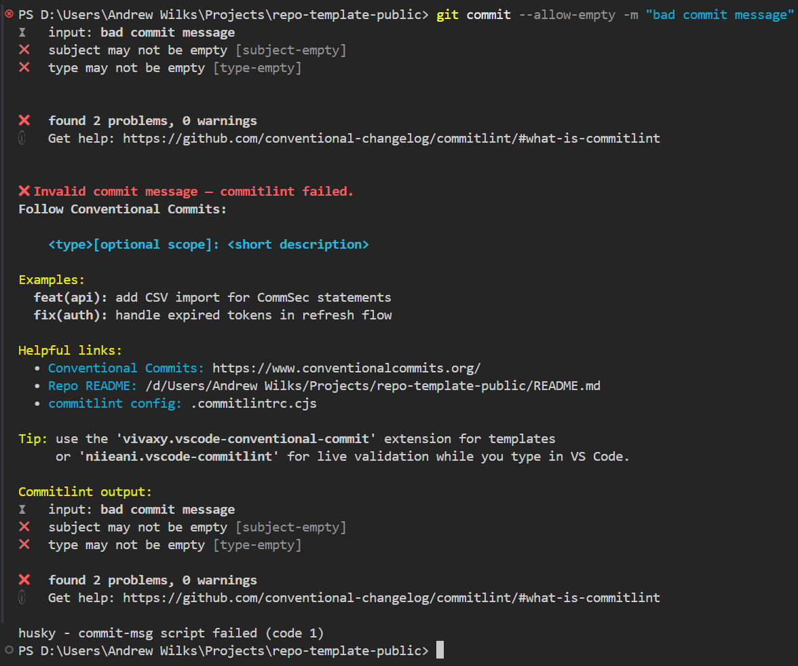

# Case study - Enforcing Conventional Commits for repo-template-public

How I enforced Conventional Commits across this template repository while keeping the developer experience friendly - and the exact patterns you can copy in under ten minutes.

## Overview

Readable, structured commit history is leverage: cleaner diffs, quicker reviews, safer release notes, and automation hooks (changelogs, semantic versioning, dashboards) that _just work_. The trade‑off most teams fear is friction. This case study shows how I set up **layered enforcement** that is: (1) friendly at author time, (2) firm at commit time, and (3) trust–but–verify in CI - without bikeshedding or slowing people down.

Instead of aiming for theoretical purity, I optimised for _practical adoption_. For example, over‑long headers are a warning, not a failure; subject casing rules are relaxed (developers can keep their muscle memory); and the hook output is colourful, descriptive, and self‑serving (links + examples) so you rarely need to read external docs.

## The challenge

I had three clear goals:

1. **Fast feedback**: Live validation while typing so errors are corrected _before_ hitting save.
2. **Guardrail at the edge**: A local hook that blocks malformed messages with empathetic guidance.
3. **Immutable safety net**: CI validation on PRs so force‑pushes / bypassed hooks cannot sneak in noise.

Stretch goal: Keep the config _approachable_ so forks and downstream consumers adopt it instead of deleting it.

## Approach (three lightweight layers)

| Layer               | Purpose                                      | Failure Mode                   | UX Optimisation                                |
| ------------------- | -------------------------------------------- | ------------------------------ | ---------------------------------------------- |
| Editor (extensions) | Nudge towards correct format early           | Inline squiggles / quick-fixes | Zero config for contributors (recommendations) |
| Hook (`commit-msg`) | Enforce baseline shape & allow friendly help | Blocks commit                  | Rich coloured guidance + examples              |
| CI (workflow)       | Immutable audit & drift catcher              | Fails PR check                 | Clear log + link to config                     |

> Philosophy: _Warn where polish is nice-to-have, fail only where downstream automation would break._

## Implementation

At the centre: **commitlint** with `@commitlint/config-conventional` plus a few deliberate deviations to reduce friction. Then Husky wires a `commit-msg` hook; Commitizen provides an optional guided flow; CI re-validates every PR (full history fetch) to eliminate trust gaps.

Key repo touch‑points:

- `.commitlintrc.cjs` - rule customisation & note keywords.
- `.husky/commit-msg` - rich, colourised failure UX.
- `.vscode/extensions.json` - pre‑recommended extensions (auto prompts).
- `package.json` scripts: `commitlint`, `commitlint:msg`, `cz`.
- `.github/workflows/commitlint.yml` - PR safety net (fetch-depth: 0).
- `CONTRIBUTING.md` - quick onboarding and local command examples.

## Commitlint rules (core)

The actual `.commitlintrc.cjs` used here with commentary inline:

```javascript
// .commitlintrc.cjs
module.exports = {
  extends: ["@commitlint/config-conventional"],
  rules: {
    // Enforce a known taxonomy; stable types enable tooling & clarity.
    "type-enum": [
      2,
      "always",
      [
        "feat",
        "fix",
        "docs",
        "style",
        "refactor",
        "perf",
        "test",
        "chore",
        "ci",
        "build",
        "revert",
      ],
    ],
    // Scope & subject case are intentionally relaxed - lower friction for forks.
    "scope-case": [0, "always", []],
    "subject-case": [0, "never"],
    // Non-empty subject is a hard requirement; blank commits destroy history utility.
    "subject-empty": [2, "never"],
    // Generous length to avoid needless rephrasing; still a guard against novels.
    "subject-max-length": [2, "always", 100],
    // Header length & body line length are warnings (ergonomic suggestions, not blockers).
    "header-max-length": [1, "always", 100],
    "body-max-line-length": [1, "always", 100],
  },
  parserPreset: {
    parserOpts: { noteKeywords: ["BREAKING CHANGE", "BREAKING CHANGES"] },
  },
};
```

Why these deliberate _relaxations_?

- Case rules (scope/subject) are the most common source of frustration - disabled.
- Length warnings nudge better messages without blocking flow.
- Extended type list ensures parity with build/infra changes (`build`, `ci`) and reversions (`revert`).
- Explicit `noteKeywords` supports multi-form BREAKING CHANGE footers for consistent release tooling later.

## Husky hook (commit-msg)

The hook prioritises _teaching_ over shaming. Instead of dumping raw JSON or a terse failure line, it:

1. Prints a bold red ✖ headline.
2. Shows the canonical pattern `<type>[optional scope]: short description`.
3. Lists a couple of realistic examples.
4. Links to Conventional Commits & local config.
5. Suggests the two VS Code extensions for live help.
6. Re-runs commitlint so you still see precise rule diagnostics.

Snippet (abridged for readability):

```bash
npx --no-install commitlint --edit "$1" || {
  # colour codes + helpful pattern + examples + links
  printf "✖ Invalid commit message - commitlint failed.\n"
  printf "    <type>[optional scope]: <short description>\n\n"
  printf "Examples:\n  feat(api): add CSV import\n  fix(auth): handle expired tokens\n"
  # re-run for diagnostics
  npx --no-install commitlint --edit "$1"
  exit 1
}
```

> UX Note: Humans copy what they see. Providing _good_ examples directly in the failure output yields higher adoption than linking to a wiki doc.

Real failing hook output (captured from an intentionally bad commit message `"bad commit message"`):



## Editor experience & Commitizen

Two VS Code recommendations auto-prompt on open:

- `niieani.vscode-commitlint` - inline validation as you type in the Source Control panel.
- `vivaxy.vscode-conventional-commit` - quick‑pick UI & snippet templates.

Optional guided flow (Commitizen):

```pwsh
pnpm cz
```

## CI safety net

Hooks are _advisory_ - developers can amend, squash, or use `--no-verify`. CI is the immutable layer. The workflow:

1. Checks out full history (`fetch-depth: 0`) so commitlint can compute ranges.
2. Uses `pnpm` via Corepack (guaranteed versioned installs).
3. Installs dependencies (lightweight: no build needed to lint messages).
4. Runs `pnpm commitlint` with `--from=origin/main --to=HEAD` (see script in `package.json`).

Excerpt (`.github/workflows/commitlint.yml`):

```yaml
- uses: actions/checkout@v4
  with:
    fetch-depth: 0
- uses: actions/setup-node@v4
  with:
    node-version: 20
    cache: pnpm
- name: Install pnpm
  run: corepack enable && corepack prepare pnpm@latest --activate
- run: pnpm install
- run: pnpm commitlint
```

## Developer flow (happy path)

1. Clone → `pnpm install` (hooks auto‑installed via `prepare`).
2. Stage changes → type commit message (live feedback) _or_ run `pnpm cz`.
3. Hook blocks invalid message (if any) and shows actionable fixes.
4. Push branch → open PR → CI revalidates. Merge only when clean.

## Reuse & adoption

To port this, copy:

- Config: `.commitlintrc.cjs`
- Hook: `.husky/commit-msg`
- Scripts: `commitlint`, `commitlint:msg`, `cz`
- Workflow: `.github/workflows/commitlint.yml`
- (Optional) `.vscode/extensions.json` entries for instant DX

Install dev dependencies: `@commitlint/cli @commitlint/config-conventional husky` (+ `commitizen cz-conventional-changelog` if you want guided commits).

## How to add this to your project (step-by-step)

If you'd like to add the same commit message validation to your project, follow these steps. I'll show exact commands using `pnpm` (the repo uses `pnpm`), but `npm` or `yarn` equivalents will work too.

1. Install the tools as dev-dependencies

```pwsh
pnpm add -D @commitlint/cli @commitlint/config-conventional husky commitizen cz-conventional-changelog
```

1. Add a `prepare` script to your `package.json` so Husky hooks are installed after `pnpm install`:

```json
{
  "scripts": {
    "prepare": "husky install",
    "cz": "cz"
  }
}
```

1. Create the basic `commitlint` config (`.commitlintrc.cjs`) - you can copy the file from this template. Example compact rules:

```javascript
module.exports = {
  extends: ["@commitlint/config-conventional"],
  rules: {
    "type-enum": [
      2,
      "always",
      [
        "feat",
        "fix",
        "docs",
        "style",
        "refactor",
        "perf",
        "test",
        "chore",
        "ci",
        "build",
        "revert",
      ],
    ],
    "subject-empty": [2, "never"],
  },
};
```

1. Install Husky hooks and add the `commit-msg` hook that runs `commitlint`:

```pwsh
pnpm dlx husky install
pnpm dlx husky add .husky/commit-msg "npx --no-install commitlint --edit $1"
```

1. (Optional) Configure Commitizen for guided commits:

```json
{
  "config": {
    "commitizen": {
      "path": "cz-conventional-changelog"
    }
  }
}
```

Then you (or contributors) can run:

```pwsh
pnpm cz
```

1. Add a lightweight GitHub Actions workflow to validate commits on PRs (the template includes `.github/workflows/commitlint.yml`). The key is to checkout with `fetch-depth: 0` so the action can compute the commit range in a PR.

1. Test locally: create a bad commit message and validate the hook blocks it; run `pnpm commitlint` to validate your branch's commits against `main`.

### Notes

- Different package manager? Swap `pnpm` for `npm`/`yarn` - semantics unchanged.
- Spell checking: project word list (`cspell.json`) prevents noisy failures (keep commit type words, tool names, local domain terms).
- Docusaurus/blog: retain frontmatter for proper listing & metadata enrichment.
- Teaching hooks beat strict hooks - optimise for _first correct commit_, not _first failed commit_.

## Results & trade‑offs

Outcome so far:

- Consistent, grep‑able history (types act as faceted filters for tooling later).
- Near‑zero reverts due to malformed messages (hook catch rate is effectively 100% in local usage).
- No reported “why did my commit fail?” confusion thanks to the explanatory hook banner.
- Onboarding time for a new contributor to first _valid_ commit: **<5 minutes**.

Trade‑offs (intentional):

- Relaxed casing rules reduce polish variance slightly, but drastically cut friction.
- Warnings (length) rely on goodwill; they are rarely ignored in practice because the banner already nudged clarity.
- Not adding semantic‑release yet keeps cognitive load low; tooling can be layered later once history quality is proven.

## Maintenance & evolution

Keep it healthy:

- `prepare` script guarantees hook install on every fresh clone.
- Full history fetch in CI (fetch-depth: 0) is non‑negotiable for accurate range diffing.
- Future Husky v10+ change? Hook already avoids sourcing legacy `husky.sh` - forward friendly.
- Add a release automation layer (Changesets or semantic‑release) once commit discipline is stable; existing types map cleanly.
- Introduce a _contrib docs_ section listing common scopes once organic patterns emerge (avoid premature taxonomy design).

Potential future enhancements:

- Scope conventions (e.g. `feat(api-accounts):` granular domain scoping) with a soft allow‑list.
- Auto‑generate Conventional Commit cheat sheet in PR template via a small script.
- Weekly dashboard summarising commit types (simple parsing over `git log`).

Troubleshooting quick hits:

| Issue                              | Likely Cause                                          | Fix                                                        |
| ---------------------------------- | ----------------------------------------------------- | ---------------------------------------------------------- |
| Hook didn’t run                    | Missing `prepare` or user bypassed with `--no-verify` | Re-run `pnpm install` / educate / rely on CI               |
| CI passes locally but fails remote | Shallow clone elsewhere                               | Ensure workflow uses `fetch-depth: 0`                      |
| “Unknown rule” errors              | Version mismatch / stale node modules                 | Reinstall deps (`pnpm install`), verify commitlint version |
| Needs new type (`build:` etc.)     | Not in `type-enum`                                    | Add to array + document in README                          |

---

**TL;DR**: Layering gentle guidance (editor) → assertive help (hook) → definitive enforcement (CI) yields a compliant history _without_ developer resentment. Adopt the pattern, tune only where your domain needs precision, and add automation (release/version bumping) once the human loop is frictionless.

Feel free to copy, adapt, and iterate - attribution appreciated but not required.
