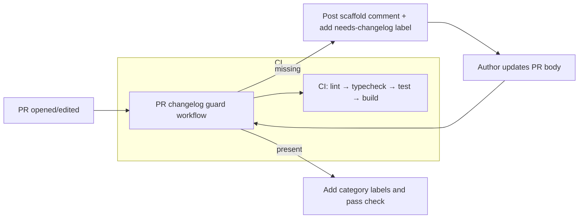

# Architecture: CI and PR changelog enforcement

This document describes the automated flow for Pull Requests, changelog enforcement, CI, and the AI-assisted changelog PR that updates `docs/repo/CHANGELOG.md`.

## Diagram

## Components referenced

Components referenced

- PR changelog guard workflow: `.github/workflows/pr-changelog-guard.yml`
- Recheck workflow: `.github/workflows/pr-changelog-recheck.yml`
- Guard helper scripts: `.github/js_repo_tools/pr-changelog-guard.mjs`
- Recheck helper scripts: `.github/js_repo_tools/pr-changelog-recheck.mjs`
- Changelog guide: `docs/repo/CHANGELOG_GUIDE.md`

## Notes and operational details

- Bypass rules: The guard supports environment configurable bypass labels (`BYPASS_LABELS`, default: `chore,dependabot,no-changelog-needed`) and an `AUTHOR_ALLOWLIST`. When bypass conditions apply the guard won't fail and will remove an existing `needs-changelog` label.
- UX: When the guard detects a missing changelog it posts a helpful scaffold comment and adds the `needs-changelog` label instead of silently failing. Authors can edit the PR body or comment `/recheck-changelog` to re-run the check.
- Keep this diagram in sync with the actual workflow filenames if they are renamed. The mermaid diagram is intentionally simple — refer to the workflow yaml files for exact triggers and permissions.

## How to update

Edit this file and update the diagram and component list when workflows or filenames change. Prefer small, incremental updates and open a PR that includes an entry in `docs/repo/CHANGELOG.md` if behavior changes.

---

Generated on branch `docs/architecture`.
